# Bitcoin-like Cryptocurrency Implementation in Rust

## Table of Contents

1. [Introduction](#1-introduction)
2. [Project Goals](#2-project-goals)
3. [Architecture and Design Principles](#3-architecture-and-design-principles)
4. [System Architecture](#4-system-architecture)
5. [File Structure Overview](#5-file-structure-overview)
6. [Module Details](#6-module-details)
   - [6.1 Core Module](#61-core-module)
     - [6.1.1 Block Submodule](#611-block-submodule-coreblock)
     - [6.1.2 Chain Submodule](#612-chain-submodule-corechain)
     - [6.1.3 Network Submodule](#613-network-submodule-corenetwork)
     - [6.1.4 Transaction Submodule](#614-transaction-submodule-coretransaction)
     - [6.1.5 CLI and RCP Submodules](#615-cli-and-rcp-submodules)
   - [6.2 Crypto Module](#62-crypto-module)
   - [6.3 Wallet Module](#63-wallet-module)
7. [Transaction Lifecycle](#7-transaction-lifecycle)
8. [Mining Process](#8-mining-process)
9. [Node Interactions](#9-node-interactions)
10. [Security Considerations](#10-security-considerations)
11. [Future Work and Roadmap](#11-future-work-and-roadmap)
12. [Conclusion](#12-conclusion)

## 1. Introduction

This project is a simplified Bitcoin-like cryptocurrency implemented in Rust. It's designed as both an educational and experimental platform, demonstrating core blockchain principles such as decentralized ledger management, transaction validation, Proof of Work (PoW) consensus, and secure cryptographic operations. Though still in early development, it provides a solid foundation for understanding and extending blockchain technology.

## 2. Project Goals

- **Educational Purpose**: Serve as a demonstrative tool to understand how blockchain, PoW, and UTXO based transactions work.
- **Security & Verification**: Leverage cryptographic primitives (hashing, digital signatures, key management) to ensure transaction authenticity and integrity.
- **Modular Design**: Create a clean, modular architecture that can be incrementally expanded to include real networking and a user interface.
- **Future Scalability**: Lay the groundwork for enhancements such as a P2P networking layer, transaction fee mechanisms, and web interface integration.

## 3. Architecture and Design Principles

The implementation follows a modular structure that separates concerns across different domains:

- **Core Blockchain Logic**: Manages blocks, chain integrity, transaction pooling, and consensus rules.
- **Cryptographic Operations**: Handles secure hashing, key generation, and signature verification.
- **Wallet and Transaction Management**: Facilitates user interactions, from signing transactions to updating balances.
- **Network Simulation**: Emulates node-to-node interactions to validate and propagate data across a decentralized system.

Key design principles include:

- **Modularity**: Each functionality (block creation, transaction processing, cryptographic operations) is isolated into its own module.
- **Security**: Robust cryptographic techniques are used to prevent tampering and double-spending.
- **Scalability and Extensibility**: The design supports simulation of multiple nodes and is ready for potential transition to a distributed network.
- **Simplicity and Clarity**: The codebase is structured for clarity, easing the learning curve and facilitating future enhancements.

## 4. System Architecture

### High-Level Component Architecture

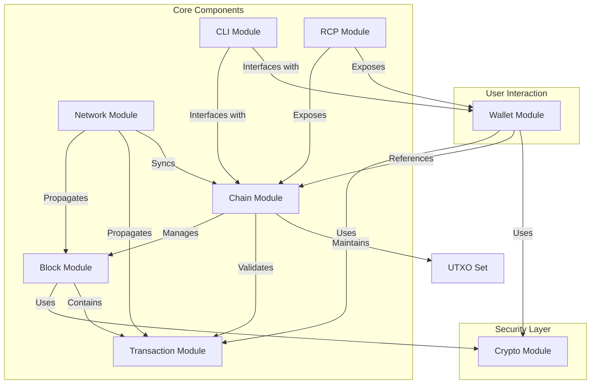

## 5. File Structure Overview

The project is organized as follows:

```
src
├── core
│  ├── block
│  │  ├── accessors.rs         # Functions to retrieve block properties
│  │  ├── mod.rs               # Block module interface and definitions
│  │  ├── pow.rs               # Proof of Work implementation (mining)
│  │  └── transactions.rs      # Block-specific transaction handling
│  ├── chain
│  │  ├── chain.rs             # Blockchain management and ledger state
│  │  ├── consensus.rs         # Consensus rules and conflict resolution
│  │  ├── mempool.rs           # Management of pending transactions
│  │  ├── mod.rs               # Chain module interface and BlockChain definition
│  │  └── transactions.rs      # Transaction integration within the chain
│  ├── cli
│  │  └── mod.rs               # Command-line interface for direct blockchain interaction
│  ├── mod.rs                  # Entry point for core functionalities
│  ├── network
│  │  ├── block.rs             # Block propagation and network validation logic
│  │  ├── blockchain.rs        # Synchronization of blockchain states across nodes
│  │  ├── mod.rs               # Network module interface and Node definition
│  │  └── transaction.rs       # Network transaction broadcasting and validation
│  ├── rcp
│  │  └── mod.rs               # Remote procedure call (API) interfaces
│  └── transaction
│     ├── mod.rs               # Transaction module interface and definitions
│     ├── transactions.rs      # Creation, signing, and validation of transactions
│     └── utxo.rs              # Unspent Transaction Output (UTXO) management
├── crypto
│  ├── hashing.rs              # Cryptographic hashing functions (SHA3-256)
│  ├── keys.rs                 # Key generation and key pair management
│  ├── mod.rs                  # Crypto module entry point
│  └── signatures.rs           # Digital signature creation and verification routines
├── main.rs                    # Entry point with simulation and testing
└── wallet
   ├── mod.rs                  # Wallet interface; handles key management
   └── transactions.rs         # Wallet-specific transaction construction
```

## 6. Module Details

### 6.1 Core Module

The `core` module is the heart of the blockchain logic, encompassing several submodules:

### 6.1.1 Block Submodule (`core/block`)

- **Responsibilities**:
  - Construct blocks containing multiple transactions.
  - Mine blocks by solving the PoW challenge defined in `pow.rs`.
  - Provide accessor functions for querying block data.
- **Key Features**:
  - **Proof of Work (PoW)**: Implemented in `pow.rs`, it ensures that new blocks satisfy a predefined difficulty by finding a nonce that produces a hash with required leading zeros.
  - **Block Structure**: Contains ID, previous hash, timestamp, nonce, transactions list, and own hash.
  - **Block Creation**: `new_template` method creates a block ready for mining, including a coinbase transaction to reward miners.

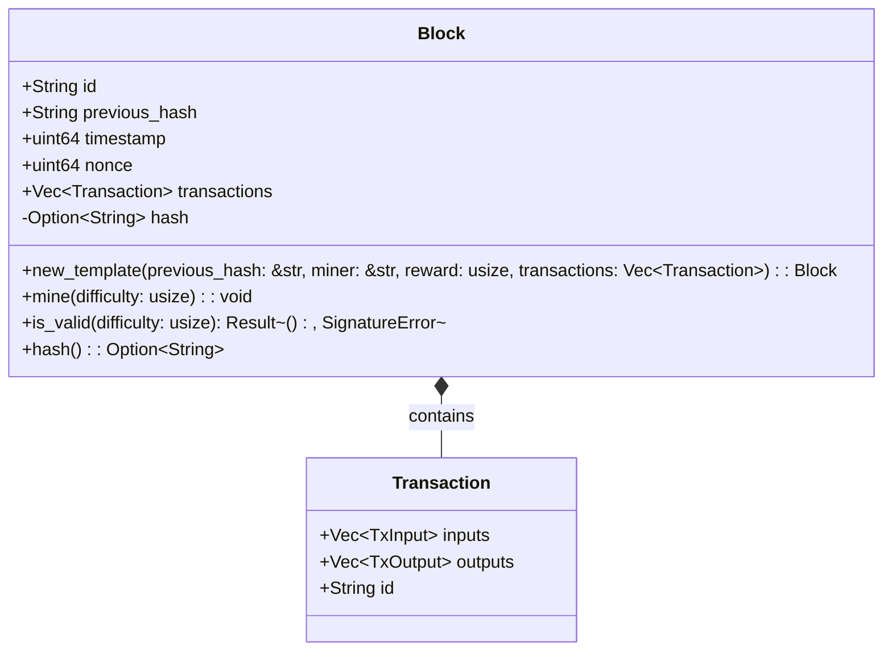

### 6.1.2 Chain Submodule (`core/chain`)

- **Responsibilities**:
  - Manage the blockchain ledger, ensuring proper block order and integrity.
  - Maintain the UTXO set to track unspent transaction outputs.
  - Handle transaction validation and inclusion in blocks.
- **Key Components**:
  - **BlockChain Structure**: Manages blocks, mempool, UTXOs, difficulty, and reward.
  - **UTXO Management**: Methods for adding and removing UTXOs when processing blocks.
  - **Transaction Processing**: `include_transaction` method validates and adds transactions to the mempool.
  - **Block Processing**: `update_from` method adds a block to the chain and updates the UTXO set accordingly.

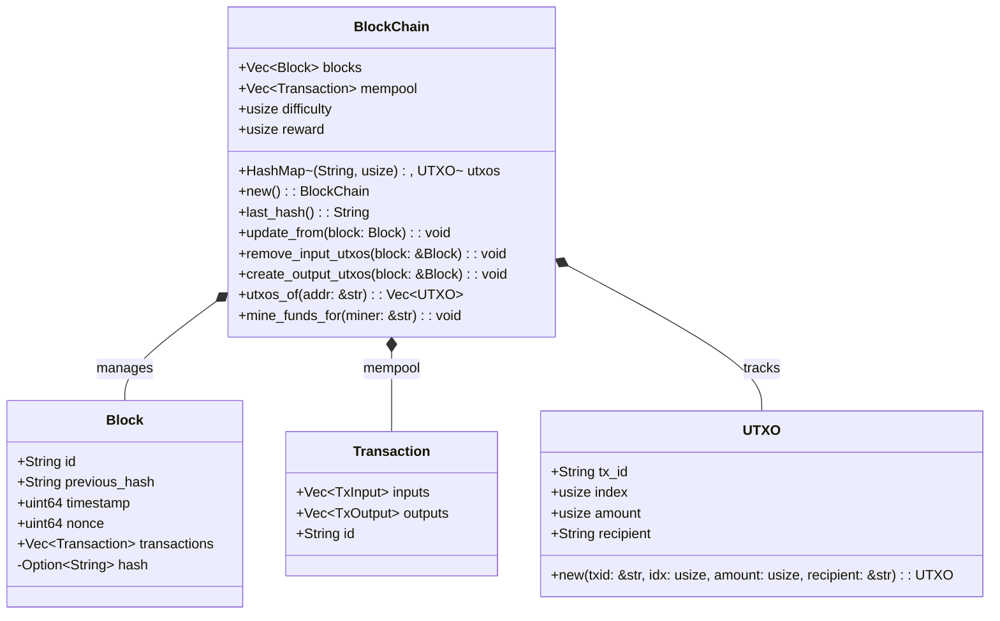

### 6.1.3 Network Submodule (`core/network`)

- **Responsibilities**:
  - Simulate decentralized network behavior for testing and development.
  - Define Node structure that manages blockchain operations in a network context.
- **Key Components**:
  - **Node Implementation**: Contains methods for validating transactions, mining new blocks, and validating blocks.
  - **Simulation Methods**: `broadcast` methods that simulate network propagation of blocks and transactions.

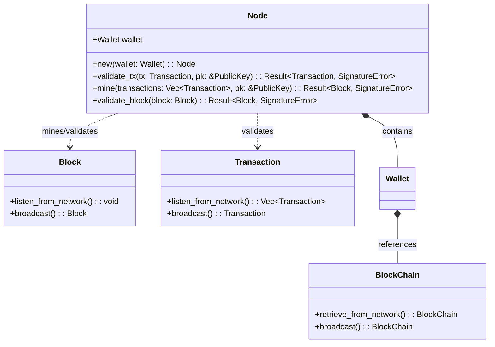

### 6.1.4 Transaction Submodule (`core/transaction`)

- **Responsibilities**:
  - Define the structure and behavior of transactions in the blockchain.
  - Manage transaction creation, validation, and UTXO handling.
- **Key Components**:
  - **Transaction Structure**: Contains ID, inputs, and outputs.
  - **UTXO Implementation**: TxInput, TxOutput, and UTXO structures for the UTXO model.
  - **Transaction Creation**: Methods for creating both regular and coinbase transactions.
  - **Validation**: `is_valid` method to verify transaction signatures.

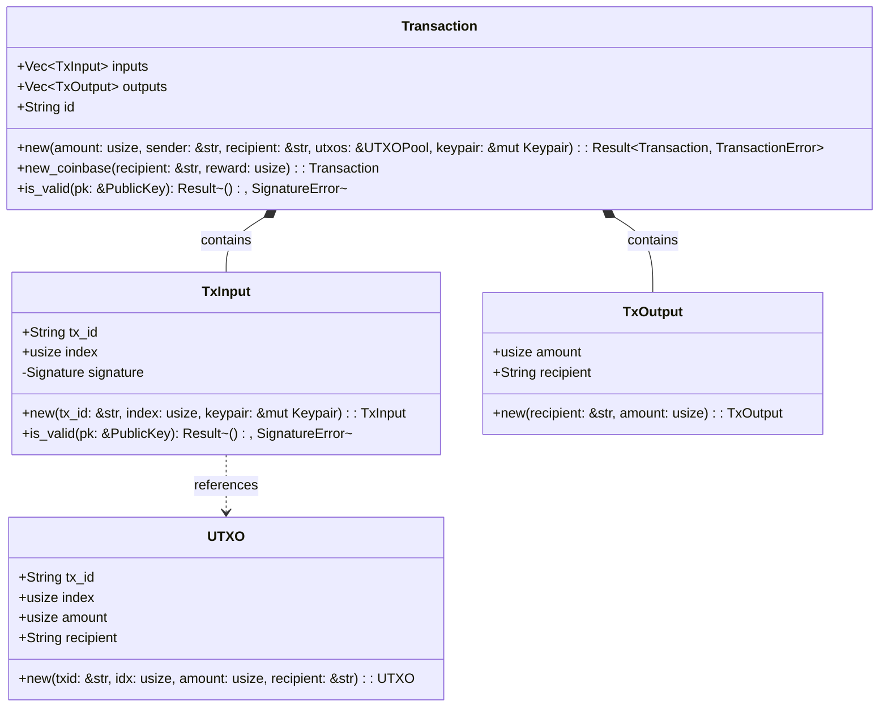

### 6.1.5 CLI and RCP Submodules

- **CLI**: Currently a placeholder module for future command-line interface implementation.
- **RCP**: Placeholder for future remote procedure call interfaces.

### 6.2 Crypto Module

The `crypto` module provides cryptographic functionality:

- **Hashing**: Implements SHA3-256 hashing for blocks and transactions.
- **Key Management**: Generates ed25519 key pairs for wallet creation.
- **Signatures**: Framework for digital signature operations.

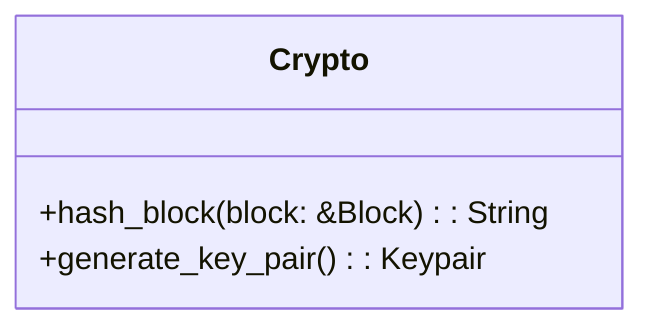

### 6.3 Wallet Module

The `wallet` module enables user interaction with the blockchain:

- **Wallet Structure**: Contains blockchain reference, address (public key representation), and keypair.
- **Transaction Creation**: `transfer` method creates and signs new transactions.
- **Initialization**: `new` method creates a wallet with a fresh keypair.

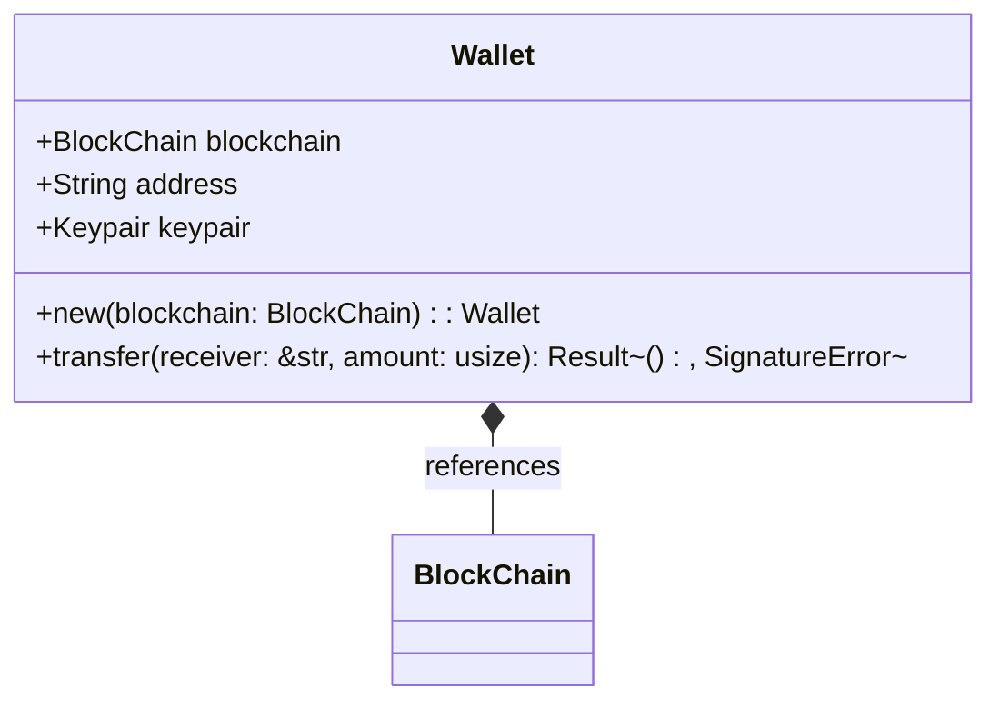

## 7. Transaction Lifecycle

The journey of a transaction through the system:

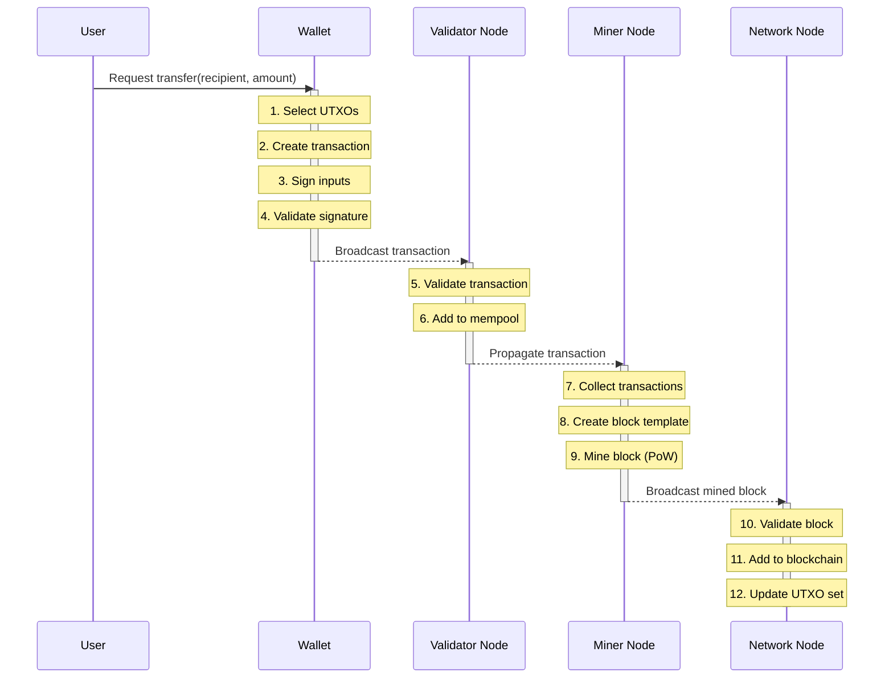

## 8. Mining Process

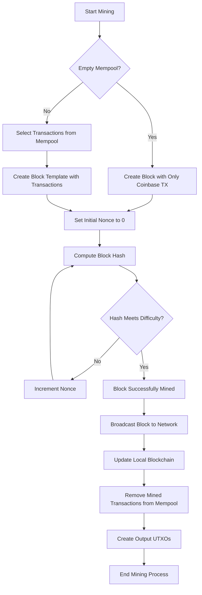

## 9. Node Interactions

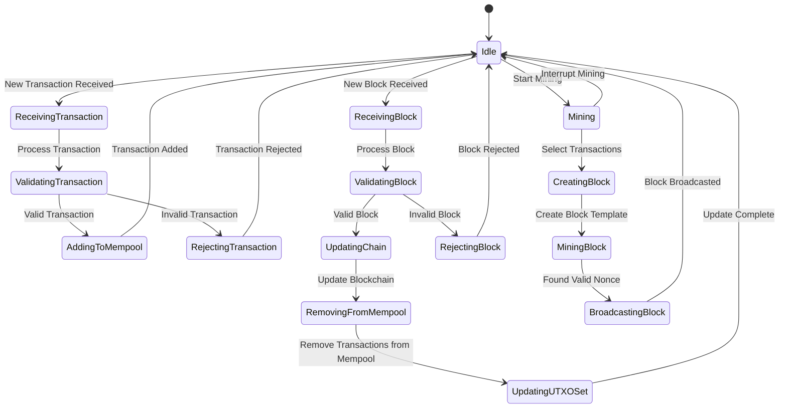

## 10. Security Considerations

Security measures in the implementation:

- **Digital Signatures**: Ed25519 signatures ensure transaction authenticity.
- **Proof of Work**: Mining difficulty prevents easy chain manipulation.
- **UTXO Validation**: Prevents double-spending by tracking spent outputs.
- **Transaction Verification**: Multiple validation points ensure transaction integrity.

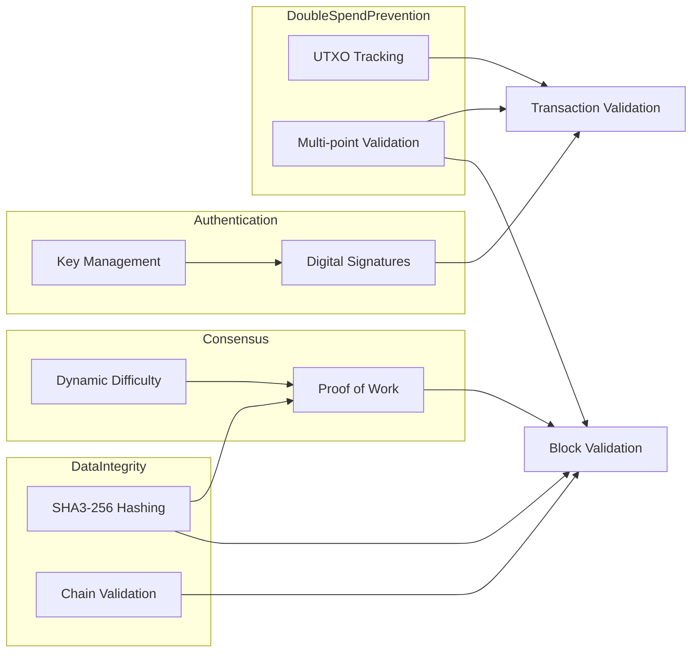

## 11. Future Work and Roadmap

Planned enhancements:

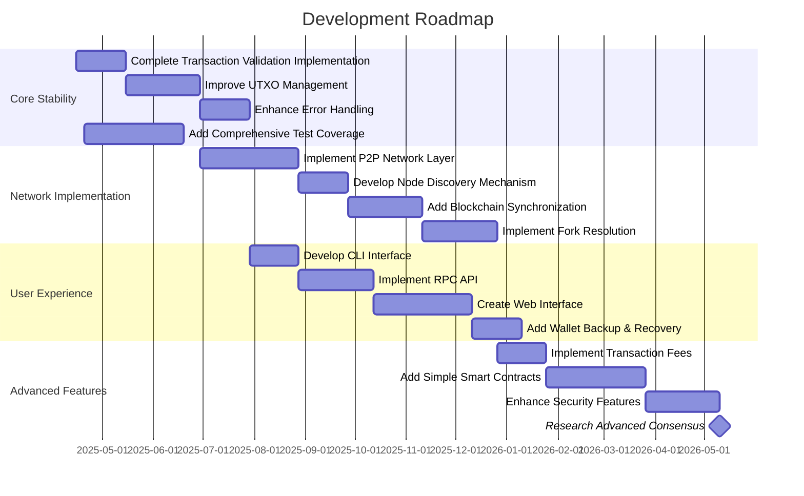

## 12. Conclusion

This Rust cryptocurrency implementation provides a solid foundation for understanding blockchain technology through a hands-on approach. The modular architecture allows for incremental improvements and learning. While primarily educational in nature, the project demonstrates the core principles that underpin real-world cryptocurrencies: secure transactions, consensus through proof-of-work, and a transparent, immutable ledger.

As development continues, the focus will be on enhancing security, networking capabilities, and usability, while maintaining the educational value of the codebase.

---
